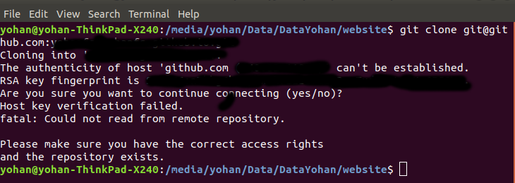

GIT
====================================================================================================

.. contents:: Daftar Isi

Getting Started
----------------------------------------------------------------------------------------------------

- Install perangkat lunak

   + `git <https://git-scm.com/download/win>`_ 
   + `git extensions <https://gitextensions.github.io/>`_

- Generate SSH Key

::
	
        $ ssh-keygen -t rsa -C "your_email@youremail.com"

Secara default, file rsa akan disimpan di ``C:\Users\username\.ssh`` (windows)
atau ``home/user/.ssh`` (ubuntu). Terdapat 2 jenis file rsa, yaitu public key
dan private key. Public key selanjutnya dikopikan ke akun git.

- Pengaturan Identitas

::

    $ git config --global user.name "your name"
    $ git config --global user.email youremail@domain.com

- Buatlah file config (tanpa ekstensi) sebagai berikut:

::

        #akun kesatu
        Host gitlab.com
                HostName gitlab.com
                Preferredauthentications publickey
                User git
                IdentityFile ~/.ssh/id_rsa_kesatu

- Bila cara di atas belum sukses, jalankan *command* berikut:

**Add**

::

    $ eval `ssh-agent -s` ssh-add id_rsa

**Cek agent**

::

    $ ssh-add -l

Jika dilihat di ``home/user``, maka tree direktori adalah:

::

        | home/user
        | ├── .ssh
        | │   ├── config
        | │   ├── known_hosts
        | │   ├── id_rsa_kesatu
        | │   └── id_rsa_kesatu.pub

- Apabila ada masalah dengan file permission (Ubuntu), jalankan *command* berikut:

::

	$ chmod 600 id_rsa_kesatu 

atau

::

	$ chmod 700 ~/.ssh
	$ chmod 600 ~/.ssh/*

Git di WSL
----------------------------------------------------------------------------------------------------

WSL (*windows subsystems for linux*) adalah *environment* yang berbeda dengan
Windows. Oleh karena itu git harus diinstall kembali di WSL. Langkah-langkahnya
seperti penjelasan di ``Getting Started``.  Ditambah dengan file config berikut:

::

        #akun kesatu
        Host gitlab.com
                HostName gitlab.com
                Preferredauthentications publickey
                User git
                IdentityFile ~/.ssh/id_rsa_kesatu

Ketika dicoba untuk mengcloning sebuah repositori, maka akan muncul *error*
sebagai berikut:

::

        Bad owner or permissions on /home/user/.ssh/config
        fatal: could not read from remote repository

        Please make sure you have the correct access rights and the repository
        exists

Solusinya adalah dengan cara menjalankan *command* berikut:

::

        chmod 600 ~/.ssh/config

**Referensi**

- `serverfault: ssh returns "Bad owner"
  <https://serverfault.com/questions/253313/ssh-returns-bad-owner-or-permissions-on-ssh-config>`_

Multiple SSH
----------------------------------------------------------------------------------------------------

Cara 1
*********************************************************************************

Tujuan membuat multiple SSH adalah untuk menggunakan akun git lebih dari 1 pada
sebuah komputer. Sebagai contoh, berikut ini 2 buah SSH key akan di-*generate*.

- Buka direktori *SSH key*. Kemudian git-bash di folder tersebut.

::

        C:\Users\username\.ssh
    

- *Generate* SSH key
  
        * SSH key 1: ``ssh-keygen -t rsa -C "your_email@youremail.com"``

        * SSH key 2: ``ssh-keygen -t rsa -C "your_email@youremail.com"``
        

Beri nama masing-masing key di atas dengan id_rsa_kesatu dan id_rsa_kedua

- Buat file config, yang berisi

::

        #akun kesatu
        Host gitlab
                HostName gitlab.com
                User git
                IdentityFile ~/.ssh/id_rsa_kesatu

        #akun kedua
        Host github.com
                HostName github.com
                User git
                IdentityFile ~/.ssh/id_rsa_kedua

        #akun ketiga
        Host github.com-yohan
                HostName github.com
                User git
                IdentityFile ~/.ssh/id_rsa_ketiga

- *Add* kedua *key* tersebut

::

        eval `ssh-agent -s` ssh-add id_rsa_kesatu ssh-add id_rsa_kedua
    

- Cek *key* yang telah tersimpan:

::

        ssh-add -l
    
- Bila diperlukan, hapus ssh-agent yang tersimpan sebelumnya, kemudian add kembali

::

      ssh-add -D

- Masukkan *public key* ke akun git

Berdasarkan pengalaman, apabila multiple akun tersebut berasal dari host yang
sama, misalnya dari github, maka ada modifikasi tambahan yang perlu dilakukan.
Modifikasi tersebut dilakukan pada file config yang bisa ditemukan di dalam
folder (.git). Folder ini secara default dalam kondisi hidden sehingga untuk
menampilkan perlu unhidden dulu. Pada file config tersebut, url repository perlu
disesuaikan dengan hostname. Misalnya:

::

        [remote "origin"] url = git@github.com-yohan:yourRepository.git

Catatan lain perihal config file ini adalah penggunaan tab sebelum kata
HostName. Tab yang terlalu panjang ternyata menyebabkan config file tersebut
tidak berjalan (lihat gambar di bawah).  Oleh karenanya, contoh di atas bisa
diikuti agar config tersebut bisa berjalan.

- Cek koneksi ssh

::

   ssh -T git@gitlab.com

**Referensi**

- `Multiple SSH Keys settings for different github account
  <https://gist.github.com/jexchan/2351996>`_ 
- `Could not open a connection to your authentication agent <https://stackoverflow.com/questions/17846529/could-not-open-a-connection-to-your-authentication-agent>`_

Cara 2
*********************************************************************************

Buat file config:

::

        Host *
          IdentityFile ~/.ssh/keys/%r@%h

Simpan ssh key di ~/.ssh/keys/ dengan format <user>@<host>. Contoh struktur foldernya adalah:

::

        ~/.ssh/keys/
        |__ git@github.com
        |__ git@github.com.pub

**Referensi**

- `Using separate SSH keys per host`_

Git Path
----------------------------------------------------------------------------------------------------

Supaya git bisa dijalankan di command line di windows, git harus disertakan di
``System Environment`` Windows. Path-nya sebagai berikut:

::

        C:\Program Files\Git\cmd

Git Bash
----------------------------------------------------------------------------------------------------

Git Bash merupakan sebuah terminal yang diinstall secara bersamaan dengan git.
Git bash ini bisa digunakan sebagaimana terminal pada umumnya. *Command*-nya
juga sama dengan terminal di ubuntu. Salah satu fitur yang saya sukai adalah
pengaturan ``alias`` di sistem terminal ubuntu yang juga tersedia di Git bash.
Alias ini berguna untuk menyederhanakan sebuah *command* menjadi *command* yang
namanya bisa diset sesuai dengan keinginan. Misalnya, sebuah *command*: ``git
status`` bisa menjadi ``gs``. Cara yang perlu dilakukan adalah dengan
mengaturnya di file yang bernama ``.bashrc``. Di Windows, file ini disimpan di :
``C:\Users\username\.bashrc``. 

Contoh penulisan alias:

::

        alias gs='git status'

Dengan konsep ini, kita juga bisa membuat *command* untuk menuju folder
tertentu. Misalnya ingin menuju folder D:\library\yohan, maka aliasnya:

::

        alias lib='cd /d/library/yohan'

Dengan demikian, *command* yang panjang dan sering digunakan bisa dipermudah dan
*working flow* bisa menjadi lebih cepat.       

Update Git
----------------------------------------------------------------------------------------------------

Sebelum update, cek versi terlebih dahulu di Terminal:

::

        git --version

Kemudian update dengan cara:

**Windows**

::

        git update-git-for-windows

**Linux**

::

        sudo add-apt-repository ppa:git-core/ppa -y
        sudo apt-get update
        sudo apt-get install git -y
        git --version

**Referensi**

- `Atlassian: installing and upgrading git <https://confluence.atlassian.com/bitbucketserver/installing-and-upgrading-git-776640906.html>`_
- `unix.stackexchange: update git using apt-get <https://unix.stackexchange.com/questions/33617/how-can-i-update-to-a-newer-version-of-git-using-apt-get>`_ 

Syntax Dasar Git
----------------------------------------------------------------------------------------------------

Syntax dasar untuk melakukan push dan pull melalui terminal (di windows: git
bash).

- Push

::

        $ git status
        $ git add . 
        $ git commit -m "isi pesan di sini"
        $ git push origin master
        

- Pull

::

        $ git pull origin master

**Referensi**

- `git-scm: basic syntax <https://git-scm.com/docs/gittutorial>`_

Membuat Repositori Baru
----------------------------------------------------------------------------------------------------

Ada 2 cara untuk membuat repositori git. Pertama dengan cara cloning repositori
dari remote. Kedua dengan cara menjadikan eksisting folder menjadi git
repositori. Untuk kedua langkah tersebut, langkah awalnya adalah sama, yaitu
membuat *remote repository*. Selanjutnya dapat mengikuti langkah-langkah
berikut:

- Cloning Repositori

::

    git clone "url git repository" `

- Existing Folder

::

    git init
    git remote add origin "url git repository"
    

Setelah folder dibuat dan diisi dengan files, maka selanjutnya data tersebut
bisa disimpan di *remote repository* dengan cara:

::

        git add . 
        git commit -m "initial commit"
        git push -u origin master

Mengabaikan File
----------------------------------------------------------------------------------------------------

Terkadang ada files di dalam folder git yang tidak ingin kita *push* ke
repositori. Files tersebut memungkinkan di-*ignore* dengan cara mendefinisikan
dalam sebuah file dengan ekstensi **.gitignore**.

Sebagai contoh folder yang bernama **tes** ingin diabaikan oleh git maka isi
dari file **.gitignore** adalah:

::

        # Ignore folder named 'tes'
        files/tes/

File **.gitignore** ini bisa ditempatkan di folder mana saja di dalam file git.
URL folder yang diabaikannya mengunakan URL relative terhadap file
**.gitignore**.

Submodule
----------------------------------------------------------------------------------------------------

*Command* untuk meng-*cloning* git repository sebagai submodule sebagai berikut:

::

        git submodule add [url to git repo]
        git submodule init

**Referensi**

- `Using submodules in Git - Tutorial
  <https://www.vogella.com/tutorials/GitSubmodules/article.html>`_

Git Branch
----------------------------------------------------------------------------------------------------

Ketika membuat sebuah repositori di git, maka secara default akan dibuatkan
sebuah repositori yang bernama ``master``. Repositori ini sebenarnya adalah
sebuah branch. Di dalam git, memungkinkan untuk mengcloning branch tersebut
dengan menggunakan nama branch yang baru. Dengan demikian, perubahan yang
terjadi di branch yang baru tidak langsung mengubah data di ``master``. 

Setiap commit yang dilakukan disimpan sebagai snapshot data pada commit
tersebut. Contoh snapshot commit pada branch master adalah sebagai berikut:

Data tersebut bisa dilihat dengan *command*:

::

        git log --oneline

Branch master tersebut memiliki 3 buah commit. Commit yang terakhir ditandai
dengan pointer ``head``. Misalnya pada contoh ini, branch yang bernama testing
dibuat dengan cara:

::

        git branch testing

Maka akan ada 2 buah branch sebagai berikut:

Sampai sini, branch testing hanya ada di lokal komputer. 

Untuk bekerja dengan branch ``testing``, jalankan *command* berikut:

::

        git checkout testing

Maka pointer head akan berpindah ke branch testing. 

.. image:: images/gitbranch_testing_head.svg

Setelah melakukan perubahan di branch testing, kemudian commitlah data tersebut
dengan cara:

::

        git add .  git commit -m "C3"

Maka history git sekarang menjadi:

Selanjutnya, setelah semua pengembangan di branch testing selesai dikerjakan.
Datanya bisa digabungkan dengan branch master. Caranya adalah dengan memindahkan
pointer head ke master terlebih dahulu:

::

        git checkout master

Kemudian gabungkan dengan ``git merge``:

::

        git merge testing

Maka history git sekarang menjadi:

Apabila branch testing sudah tidak diperlukan lagi, branch tersebut bisa
didelete dengan cara:

::

        git branch -d testing

**Referensi**

- `Git branching
  <https://git-scm.com/book/en/v2/Git-Branching-Basic-Branching-and-Merging>`_

Delete Git Branch
----------------------------------------------------------------------------------------------------

Git Branch harus di-delete di lokal dan di remote. Caranya adalah:

- Lokal

::

        git branch -a #to see the list of branches
        git branch -d repositoryname

Catatan: Gunakan -D untuk *force delete*.

- Remote

::

        git branch -a #to see the list of branches
        git push origin --delete repositoryname

Git Merge
----------------------------------------------------------------------------------------------------

Ada 2 kondisi untuk merge, *fast-forward merge* dan *three-way merge*.

**Fast-Forward Merge**

*Fast-forward merge* terjadi ketika ada path yang linier antar branch yang mau
di-merge. 

**Three-Way Merge**

*Three-way merge* terjadi ketika path-nya tidak linear. Merge ini akan
menambahkan commit tambahan untuk menggabungkan 2 branch tersebut. 

**References**

- `Git Branching - Branches in a Nutshell
  <https://git-scm.com/book/en/v2/Git-Branching-Branches-in-a-Nutshell>`_
- `Atlassian: Merging vs Rebasing <https://www.atlassian.com/git/tutorials/merging-vs-rebasing>`_
- `git-scm: Git Branching - Rebasing <https://git-scm.com/book/en/v2/Git-Branching-Rebasing>`_
- `How to Use git Merge <https://dev.to/neshaz/how-to-use-git-merge-the-correctway-25pd>`_ 

Undo Last Changes
----------------------------------------------------------------------------------------------------

Undo Last Commit
*********************************************************************************

- *Commit* terakhir akan dihapus dari Git history

::

    $ git reset --soft HEAD~1

HEAD~1 artinya adalah me-*reset* HEAD (*commit* terakhir).

- Cek log history

::

    $ git log --oneline

**Referensi**

- `devconnected: how to undo last git commit
  <https://devconnected.com/how-to-undo-last-git-commit/>`_

Discard Unstaged Files
*********************************************************************************

::

        git checkout .. -

**Referensi**

- `stackoverflow: discard unstaged changes <https://stackoverflow.com/questions/52704/how-do-i-discard-unstaged-changes-in-git>`_ 

Lokal Git Storage
---------------------------------------------------------------------------------

**Pengertian Git dan Github/Gitlab**

Berikut ini adalah pengertian Git dan Github/Gitlab berdasarkan pemahaman saya. 

Git dan github/gitlab adalah *service* yang berbeda. Git adalah *version
control software* yang bekerja di lokal komputer. Sedangkan github/gitlab adalah
cloud service untuk penyimpanan data Git (*server*). 

Dengan konsep tersebut, saya kemudian berekperimen untuk menyimpan *remote* data
di lokal *server* dan berhasil dijalankan baik itu di Windows, Linux, dan MacOS.

**Tutorial**

Berikut ini adalah tutorialnya:

- create *remote folder* di *server*, misalnya:

**Ubuntu**

::

   $ /mnt/remoteFiles/tes

**Windows**

::

   $ /Y/remoteFiles/tes

**Windows/Ubuntu/MacOS | General path**

::

   $ ssh://username@ipaddress/path/to/remote.git

Untuk cek path dari metode ssh adalah dengan perintah ``$ pwd``. 

Semua path di atas dinamakan ``/path/to/remote`` yang akan digunakan pada *syntax* di
penjelasan berikutnya.

- jadikan sebagai git repository

::

   $ git init --bare

- create lokal repo 

::

   $ git init
   $ git remote add origin /path/to/remote

Misalnya:

::

   $ git remote add origin /mnt/remoteFiles/tes

- push to remote

::

   $ git push -u origin master

- Cloning

::

   $ git clone /path/to/remote

**Referensi**

- `tutorial from other <https://unixnme.blogspot.com/2016/07/how-to-setup-git-server-on-mac-os-x.html>`_

Lokal Git Web (Self Hosted)
---------------------------------------------------------------------------------

Gitlab
*********************************************************************************
**Install Gitlab**

Berikut ini adalah cara install Gitlab di Ubuntu 20.04:

- update

::

        $ sudo apt update

- install dependencies

::

        $ sudo apt-get install -y curl openssh-server ca-certificates

- jika ingin Gitlab untuk mengirimkan notifikasi email (optional)

::

        $ sudo apt-get install -y postfix

- install Gitlab CE

::

        $ curl -sS https://packages.gitlab.com/install/repositories/gitlab/gitlab-ce/script.deb.sh | sudo bash

::

        $ sudo apt-get install gitlab-ce

atau *command* berikut ini jika ingin menggunakan external url

::

        $ sudo EXTERNAL_URL="http://gitlabce.example.com" apt-get install gitlab-ce

- untuk konfigurasi ulang external_url atau konfigurasi lainnya, editlah file berikut

::

        $ sudo vim /etc/gitlab/gitlab.rb

- selanjutnya jalankan *command* berikut

::

        $ sudo gitlab-ctl reconfigure
        $ gitlab-ctl start
        

- akses via web browser

::

        https://your_gitlab_domain_or_server_IP

- saat pertama kali dijalankan akan diminta untuk membuat password
- *default username* adalah **root**. 

**Uninstall Gitlab**

::

        $ sudo apt-get remove gitlab-ce
        $ sudo rm -rf /var/opt/gitlab
        $ sudo pkill -f gitlab
        $ sudo rm -rf /opt/gitlab
        $ sudo rm -rf /etc/gitlab
        $ sudo rm -rf /var/opt/gitlab

Kemudian restart komputer.         

**Referensi**

- `gitlab.com: install self-managed gitlab`_
- `medium: install gitlab`_
- `konfigurasi gitlab`_

Gitea
*********************************************************************************

**Install Gitea**

Berikut ini adalah cara install Gitea di Raspberry Pi menggunakan docker-compose.yml:

- docker-compose.yml

::

	version: '2'
	services:
	  web:
	    image: kunde21/gitea-arm
	    container_name: gitea
	    environment:
	      - USER_UID=1000
	      - USER_GID=1000
	      - DB_TYPE=mysql
	      - DB_HOST=db:3306
	      - DB_USER=gitea
	      - DB_PASSWD=<yourpassword>
	    restart: always
	    volumes:
	      - ./data:/data
	    ports:
	      - "80:3000"
	      - "2200:22"
	    depends_on:
	      - db
	  db:
	    image: jsurf/rpi-mariadb
	    restart: always
	    environment:
	      - MYSQL_ROOT_PASSWORD=<yourpassword>
	      - MYSQL_DATABASE=gitea
	      - MYSQL_USER=gitea
	      - MYSQL_PASSWORD=<yourpassword>
	    volumes:
	      - ./db/:/var/lib/mysql	

- Jalankan docker compose

::

	$ docker-compose up

- Kemudian buka browser dan isi data yang diminta pada initial page

- Kemudian buatlah ssh di *client computer* dan beri nama gitea

::

	$ ssh-keygen

Kemudian buatlah config dengan isi sebagai berikut:

::

	Host gitea.ysi
	  HostName <IP Address>
	  User git
	  Port 2200
	  IdentityFile ~/.ssh/gitea 

SSH tersebut dapat dites dengan cara:

::

	$ ssh -T gitea.ysi

Perlu diperhatikan di sini bahwa ssh menggunakan port 2200 sehingga perlu
disertakan di dalam config. 

**Konfigurasi**

Konfigurasi dapat dilakukan pada file /data/gitea/conf/app.ini. 

**Referensi**

- `Gitea`_

Git Fetch vs Git Pull
---------------------------------------------------------------------------------

Syntax

::

        $ git fetch origin 

::

        $ git pull origin master

Persamaan

        Git fetch and git pull digunakan untuk mengunduh data baru dari *remote
        repository*. 

Perbedaan

        Git fetch hanya mengunduh metadata baru dari *remote repository*, tetapi
        tidak mengintegrasikan data baru ke *working files*. 

        Git pull mengunduh semua data dan mengintegrasikan data tersebut ke
        *remote repository*. 

        Dikarenakan Git pull akan mengabungkan (merge) data remote ke lokal,
        maka *merge conflict* bisa terjadi. Gunakanlah *git pull* hanya dengan
        *clean working copy*. Ini artinya tidak terdapat *local changes* sebelum
        pull. 

Referensi

- `how to use git fetch and git pull effectively <https://gitbetter.substack.com/p/how-to-use-git-fetch-and-git-pull>`_

Git Status
---------------------------------------------------------------------------------

**Fungsi**

``Git status`` berfungsi untuk menunjukkan status, misalnya sudah commit dan
push.

::

	$ git status

Git Config
---------------------------------------------------------------------------------

Line Endings
*********************************************************************************

**Isu**

Apabila git yang dibuat pertama kali di sistem operasi Windows dibuka di sistem
operasi lain dalam hal ini Linux, maka walaupun data sudah sinkron dengan
remote, ``git status`` di Linux akan menunjukkan bahwa beberapa file dalam kondisi
*modified* sehingga harus di-add dan commit. Ini dikarenakan ada isu dengan
*line endings*. Untuk mengatasi hal tersebut jalankan command berikut:

**Windows**

::

	$ git config --global core.autocrlf true

**Linux**

::

	git config --global core.autocrlf input

**Referensi**

- `git status shows all files as modified <https://github.com/microsoft/WSL/issues/184>`_
- `customizing git - git configuration`_

Config File
*********************************************************************************

*Typical config*:

::

	[core]
		repositoryformatversion = 0 
		filemode = true
		autocrlf = input
		bare = false
		logallrefupdates = true
	[remote "gitlocal"]
		url = git@gitlocal.ysi:phd/diss.git
		fetch = +refs/heads/*:refs/remotes/gitlocal/*
	[branch "master"]
		remote = gitlocal
		merge = refs/heads/master
                               
Lokasi config ada di:

::

	.git/config

Push to Non-Bare Repo    
*********************************************************************************

Secara default, repo di server adalah berupa *bare* repo. Sedangkan repo di
client yang digunakan sebagai *working repo* adalah *non-bare* repo. Push hanya
bisa dilakukan ke *bare* repo. Tetapi, hal ini bisa diubah agar push bisa
dilakukan ke *non-bare* repo dengan cara:

::

    git config --local receive.denyCurrentBranch updateInstead

Git Tag
---------------------------------------------------------------------------------

Tag biasanya digunakan untuk menandai rilis sebuah *software*. 

**Menampilkan daftar tag**

::

	$ git tag

**Membuat tag**

::

	$ git tag -a v1.0 -m "versi ke 1.0"

-m adalah untuk menambahkan pesan. Apabila tidak ditambahkan pesan, maka git
akan membuka text editor. 

**Tag commit terdahulu**

::

	$ git tag -a v1.1 9fceb02

``9fceb02``  adalah nama commit-nya. Bisa dilihat di:

::

	$ git log --oneline 

**Push tag ke remote (misalnya: github/gitlab)**

Secara *default*, git push tidak mentransfer tag ke *remote servers* seperti
github/gitlab. Untuk mempush tag, lakukan:

::

	$ git push origin v1.1

untuk mempush semua tag:

::

	$ git push origin --tags

**Delete lokal tag**

::

	$ git tag -d v1.1

**Delete remote tag**

::

	$ git push <remote> :refs/tags/v1.1
	$ git push origin :refs/tags/v1.1

atau

::

	$ git push origin --delete v1.1

**Checkout tag**

::

	$ git checkout v1.1

**Referensi**

- `Git docs: git basics - tagging`_

Multiple Remotes
---------------------------------------------------------------------------------

Remote bisa ditambahkan sebanyak yang diinginkan. 

Secara default, nama remote biasanya adalah **origin**, sehingga remote biasanya
ditambahkan dengan *command* (contoh):

::

        $ git remote add origin git@github.com:username/gitrepo.git

Nama **origin** hanya boleh satu. Untuk menambahkan remote baru, buatlah nama
remote dan url repo. Misalnya untuk menambahkan remote yang bernama
**newremote**, caranya adalah:

::

        $ git remote add newremote git@gitlab.com:username/gitrepo.git

Oleh dikarenakan ada 2 remote, perlu diperhatikan lagi alamat saat pull dan
push. 

Misalnya untuk pull dari **newremote**:

::

        $ git pull newremote master

dan untuk push ke **newremote**:

::

        $ git push newremote master

Continuous Integration
---------------------------------------------------------------------------------

Continuous Integration (CI) digunakan untuk mencompile secara otomatis program
yang ada di dalam *repository*. 

Gitlab CI
*********************************************************************************

**Contoh Gitlab CI**

Cara mengaktifkannya adalah dengan membuat file **.gitlab-ci.yml**. 

Berikut ini adalah contoh isi dari **.gitlab-ci.yml**. Isi file tersebut untuk 
mengcompile latex file. 

::

	compile_pdf:
	  image: aergus/latex
 	  script:
            - pdflatex main.tex
 	  artifacts:
   	    paths:
      	      - main.pdf

Isi file tersebut mirip dengan docker-compose.yml. Image yang digunakan pun
memang berasal dari docker image.

**Install Gitlab Runner**

Agar Gitlab CI dapat dijalankan di self-hosted Gitlab, Gitlab Runner harus
diinstall.

**Referensi**

- `assign gitlab runner`_  

Github CI
*********************************************************************************

Buatlah file .github/workflows/compile.yml. Isinya sebagai berikut:

::

	name: Build LaTeX Document
	on:
	  push:
	    paths:
	    - '**.tex'
	jobs:
	  build_latex:
	    runs-on: ubuntu-latest
	    steps:
	      - name: Set up Git repository
		uses: actions/checkout@v1
	      - name: Compile LaTeX document
		uses: xu-cheng/latex-action@master
		with:
		  root_file: main.tex
	      - name: Uplod PDF
		uses: actions/upload-artifact@v1
		with:
		  name: PDF
		  path: main.pdf

Download Sebuah File dari Github
---------------------------------------------------------------------------------

Git clone akan mendownload semua files. Untuk mendownload sebuah file, bisa
menggunakan *command* wget. Url yang digunakan adalah url sebuah file dalam
kondisi raw. Contoh:

::

	wget https://raw.githubusercontent.com/yohanfs/Git/master/Makefile

Commor Error
---------------------------------------------------------------------------------

- `Cannot open .git/FETCH_HEAD: Permission denied`_
- `Sign and send pubkey: signing failed`_

.. Referensi

.. _`Cannot open .git/FETCH_HEAD: Permission denied`: https://stackoverflow.com/questions/32378984/error-on-git-pull-error-cannot-open-git-fetch-head-permission-denied
.. _`medium: install gitlab`: https://medium.com/@thecaffeinedev/how-to-setup-and-configure-your-own-gitlab-server-on-ubuntu-20-04-73214cf63882
.. _`konfigurasi gitlab`: https://docs.gitlab.com/omnibus/settings/configuration
.. _`gitlab.com: install self-managed gitlab`: https://about.gitlab.com/install/#ubuntu
.. _`Sign and send pubkey: signing failed`: https://stackoverflow.com/questions/44250002/how-to-solve-sign-and-send-pubkey-signing-failed-agent-refused-operation
.. _`Using separate SSH keys per host`: https://ricostacruz.com/til/using-separate-ssh-keys-per-host
.. _`Gitea`: https://gitea.io/en-us/
.. _`assign gitlab runner`: https://stackoverflow.com/questions/53370840/this-job-is-stuck-because-the-project-doesnt-have-any-runners-online-assigned
.. _`Git docs: git basics - tagging`: https://git-scm.com/book/en/v2/Git-Basics-Tagging
.. _`customizing git - git configuration`: https://git-scm.com/book/en/v2/Customizing-Git-Git-Configuration
